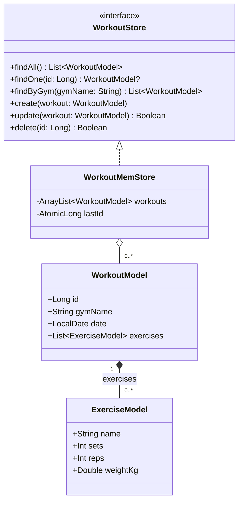

# GymTracker – UML Class Diagram

```mermaid
classDiagram
    class WorkoutModel {
        +Long id
        +String gymName
        +LocalDate date
        +List~ExerciseModel~ exercises
    }
    class ExerciseModel {
        +String name
        +Int sets
        +Int reps
        +Double weightKg
    }
    class WorkoutStore {
        <<interface>>
        +findAll() List~WorkoutModel~
        +findOne(id: Long) WorkoutModel?
        +findByGym(gymName: String) List~WorkoutModel~
        +create(workout: WorkoutModel)
        +update(workout: WorkoutModel) Boolean
        +delete(id: Long) Boolean
    }
    class WorkoutMemStore {
        -ArrayList~WorkoutModel~ workouts
        -AtomicLong lastId
    }
    WorkoutModel "1" *-- "0..*" ExerciseModel : exercises
    WorkoutStore <|.. WorkoutMemStore
    WorkoutMemStore o-- "0..*" WorkoutModel
```
